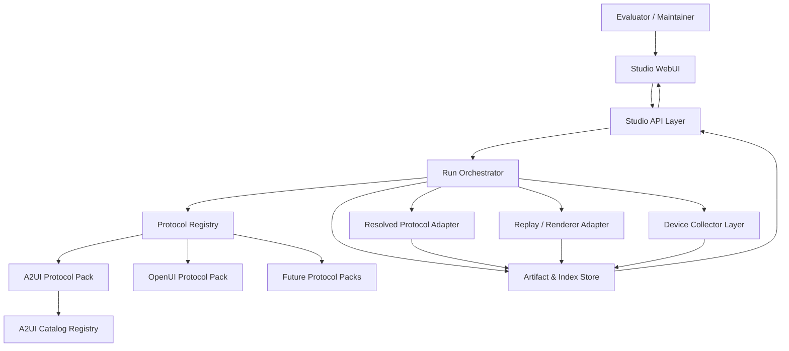
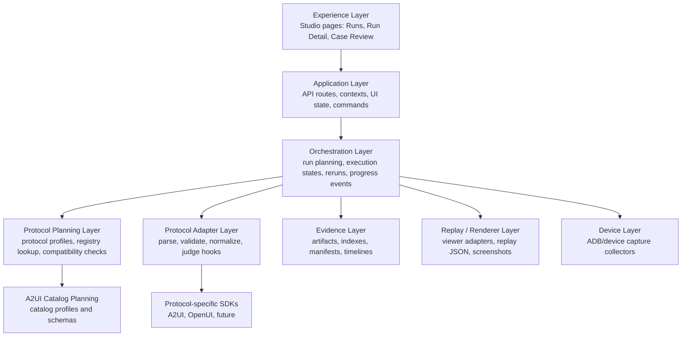
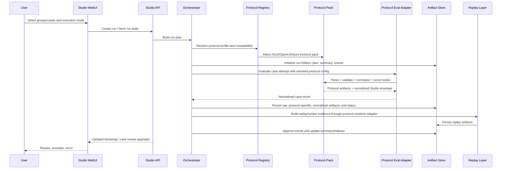
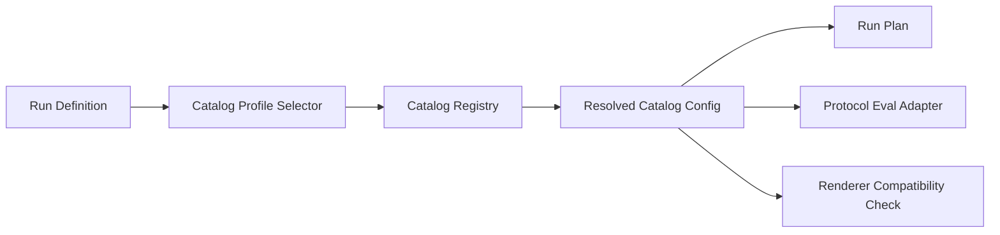
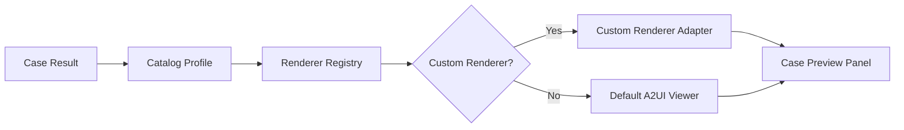
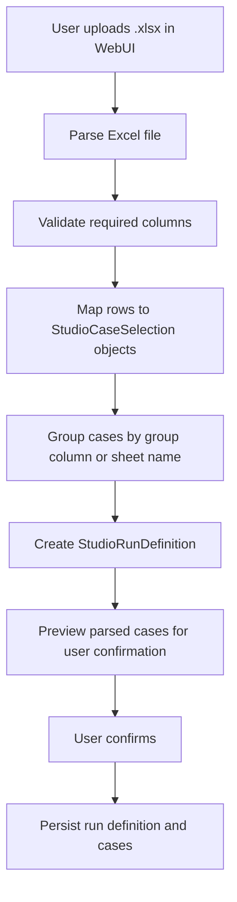
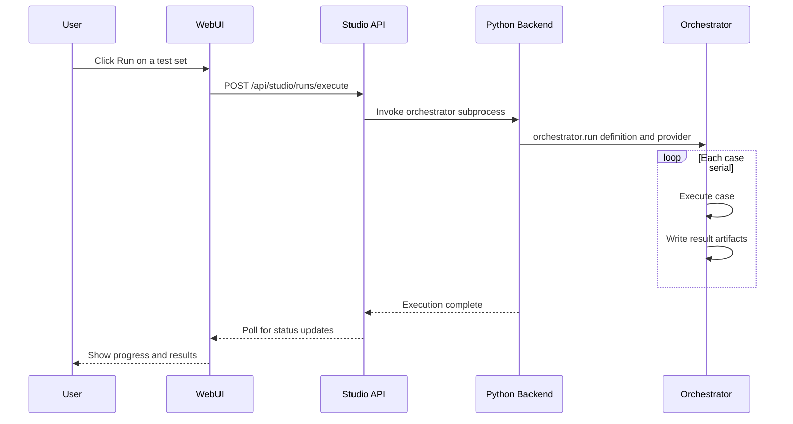
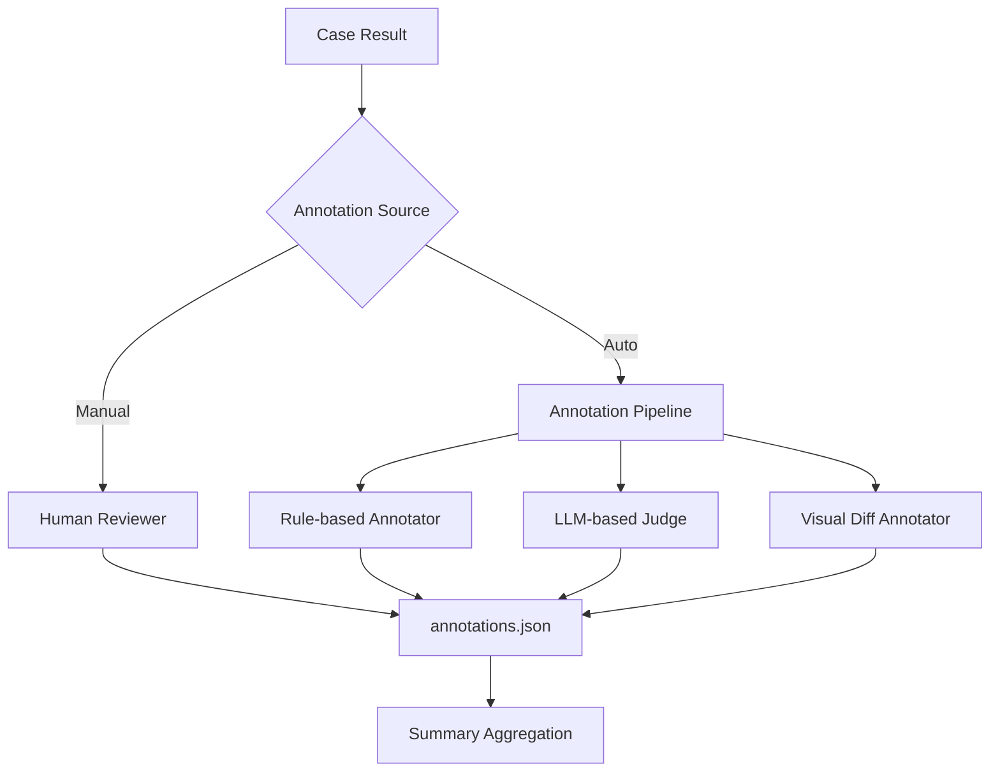
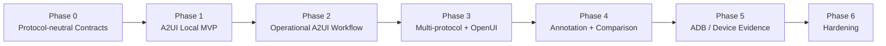
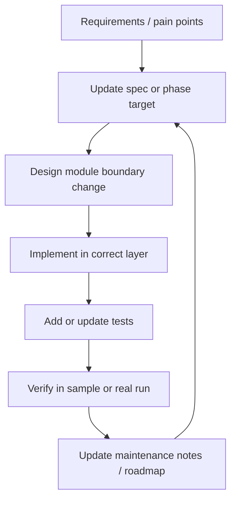

# GenUI Eval Studio Specification <span class="version-badge draft">v0.1 — Draft</span>

> This document defines the product expectations, architecture, phased delivery plan, and maintenance model for **GenUI Eval Studio**.
>
> It is intended to be the collaboration anchor for maintainers and contributors working across GenUI protocol adapters, the Studio UI, renderer integrations, evaluation workflows, and future device evidence collectors.

## Document Status

| Field | Value |
| --- | --- |
| **Status** | Draft |
| **Audience** | Maintainers, contributors, eval authors, renderer integrators |
| **Primary Scope** | Local-first production-grade Eval Studio for GenUI agent output observation, evaluation, and tuning data collection |
| **Related systems** | `eval/`, `tools/composer`, `specification/v0_9/eval/`, A2UI Python SDK, future OpenUI adapters |
| **Current implementation baseline** | MVP skeleton exists in `eval/genui_eval/studio_*`, `eval/genui_eval/protocols/*`, and `tools/composer/src/app/studio/*`; Studio core is protocol-neutral with A2UI as the first protocol pack and an OpenUI skeleton pack |

## Overview

GenUI agents need a production-grade evaluation workspace for rapid testing, evidence review, human annotation, observability, and iterative optimization across multiple UI generation protocols.

Eval Studio fills that gap.

It is **not** a replacement for protocol-specific protocol packs such as `genui_eval.protocols.a2ui`. Instead, it is a **protocol-neutral control plane and review workspace** for GenUI generation results. Protocol-specific packs provide parsing, validation, prompt shaping, rendering, and semantic rules through adapters.

Eval Studio adds:

- test-set grouping
- batch execution
- protocol-aware evaluation planning
- local artifact persistence
- replay and rendering review
- manual annotation workflows
- cross-run and cross-protocol comparison
- data collection for agent evaluation and prompt/model tuning
- later, device evidence capture via ADB

The core design principle is:

> **Studio owns orchestration, evidence, observation, annotation, and iteration. Protocol adapters own protocol correctness.**

## Goals

### Product goals

Eval Studio should enable a contributor or evaluator to:

1. define or select **groups** of test cases
2. run one or many groups/cases in **serial** or **parallel** mode
3. inspect results through a **WebUI**
4. review artifacts including:
   - raw generation output
   - protocol-specific parsed output
   - parsed and normalized messages
   - validation and scoring outcomes
   - replay/render evidence
   - later: device screenshots and logs
5. annotate failures and rerun selected subsets quickly
6. compare results across models, prompts, agent versions, protocols, protocol versions, and renderers
7. iteratively improve prompts, models, agents, renderers, validators, and device integrations

### Engineering goals

Eval Studio should:

- stay aligned with official protocol-specific eval packages without embedding their assumptions in the Studio core
- preserve raw and derived artifacts for traceability
- keep protocol/version/catalog/schema/renderer concerns isolated behind adapters
- use local filesystem storage rather than a database
- support staged evolution from MVP to production-grade tooling
- remain easy for maintainers to extend without cross-layer leakage
- support A2UI and future OpenUI generation flows through the same run/case/artifact/review model
- support application-specific custom catalogs as a first-class eval input, not a one-off hack
- support pluggable custom renderers (e.g., `@yodaos-pkg/ink`) for application-specific catalog preview
- support Excel-based batch test set creation for evaluator convenience
- provide a WebUI-driven run execution flow with real-time progress feedback
- include a manual annotation framework that is architecturally ready for future automated annotation

## Non-goals

The first complete Eval Studio specification does **not** assume:

- a database-backed multi-user SaaS platform
- cloud-native orchestration as a hard requirement
- a rewrite of the official eval engine
- immediate support for all renderers equally
- immediate support for all device evidence collectors
- perfect parity across v0.8/v0.9/v0.10 from day one
- forcing all protocols into a lossy universal UI schema
- treating A2UI catalog concepts as mandatory concepts for non-A2UI protocols

## Current State vs Target State

### Current state

Today the repository has three relevant foundations:

1. **Official eval framework** under `eval/`
   - Python + Inspect AI orchestration
   - SDK-driven prompt/schema injection
   - protocol parsing and validation
   - judge-based semantic scoring
   - currently centered on A2UI naming and runtime assumptions

2. **Older richer prototype** under `specification/v0_9/eval/`
   - batch pipeline ideas
   - artifact persistence patterns
   - viewer/replay logic
   - richer validation diagnostics
   - group-oriented result artifacts

3. **First Eval Studio MVP skeleton**
   - backend skeleton in:
     - `eval/genui_eval/studio_types.py`
     - `eval/genui_eval/studio_storage.py`
     - `eval/genui_eval/studio_adapter.py`
     - `eval/genui_eval/studio_orchestrator.py`
     - `eval/bin/create_studio_run.py`
   - frontend skeleton in:
     - `tools/composer/src/app/studio/*`
     - `tools/composer/src/app/api/studio/*`
     - `tools/composer/src/contexts/studio-context.tsx`
     - `tools/composer/src/types/studio.ts`

4. **Emerging production workflow additions**
   - catalog registry and resolved catalog config
   - Excel-based test-set parsing
   - WebUI-triggered execution
   - annotation and rerun support
   - still coupled to A2UI package names and A2UI catalog semantics

### Target state

Eval Studio should evolve into a coherent local-first system that provides:

- protocol-neutral run, group, case, attempt, artifact, annotation, and comparison models
- protocol packs for A2UI first, OpenUI later
- structured run planning
- artifact lifecycle management
- renderer replay and screenshot workflows
- annotation-driven regression review
- run comparison and rerun subsets
- later, device evidence collection and infra hardening

### Current gaps

| Area | Current state | Target state |
| --- | --- | --- |
| Run creation | WebUI can import Excel test sets and initialize filesystem-backed runs; scripts remain for fixtures and maintenance | UI-driven run definition and batch selection |
| Protocol support | Core backend and docs are A2UI-shaped | Protocol Registry + protocol packs for A2UI, OpenUI, and future GenUI protocols |
| Catalog support | A2UI adapter is effectively pinned to one basic catalog file | A2UI-pack-owned catalog selection and per-case/per-run custom catalog evaluation |
| Scheduling | WebUI can start persisted runs through the local executor; current execution loop is synchronous with live status polling | Real group/case execution planning with serial/parallel controls |
| Validation explainability | Basic adapter + official validator output | Structured targeted diagnostics and richer failure breakdown |
| Replay evidence | Replay JSON persisted; UI renders normalized messages | Replay timeline, screenshots, diffable visual evidence |
| Annotation | Not yet implemented | First-class annotation and review workflow |
| Device evidence | Not implemented | ADB screenshot/logcat/grep collector pipeline |
| Comparison workflow | Not implemented | Compare runs, rerun failed/labeled subsets |
| Hardening | Basic local files and indexes | resumability, retention policy, crash recovery, performance tuning |

## Core Domain Concepts

| Term | Meaning |
| --- | --- |
| **Run** | A single evaluation execution session initiated by the user |
| **Group** | A first-class test-set grouping used for selection, batching, filtering, and comparison |
| **Case** | A single test sample within a group |
| **Attempt** | One execution instance of a case under a chosen model / renderer / repeat count |
| **Artifact** | Any persisted output or evidence generated during evaluation |
| **GenUI Protocol** | A concrete UI generation protocol such as A2UI or OpenUI |
| **Protocol Pack** | A plugin-like bundle that implements parsing, validation, prompt construction, scoring hooks, replay conversion, and renderer compatibility for one protocol family |
| **Protocol Profile** | A reusable Studio-side configuration selecting protocol ID, version, validation policy, prompt policy, renderer support, and protocol-specific options |
| **Protocol Registry** | The local registry that resolves a protocol/profile reference into a concrete protocol pack and runtime configuration |
| **Replay** | A reconstruction of protocol output into a renderable review state |
| **Annotation** | Human feedback attached to a case result |
| **Collector** | A pluggable producer of additional evidence, such as screenshots or device logs |
| **Catalog Profile** | A2UI protocol-pack concept describing which catalog, schema set, renderer support, and validation policy an A2UI eval run should use |
| **Catalog Registry** | A2UI protocol-pack registry that resolves a `catalogId` or profile name into concrete schema files and runtime capabilities |
| **Custom Renderer** | A pluggable renderer package that provides rendering support for protocol-specific output, including application-specific A2UI catalog components |
| **Renderer Registry** | The registry that maps protocol/profile/catalog patterns to renderer adapters for case preview in the Studio WebUI |
| **Test Set Template** | An Excel file (.xlsx) containing groups of prompts that can be imported to create structured test sets |
| **Label** | A structured annotation value attached to a case result, such as `correct`, `incorrect`, or `hallucination` |
| **Annotation Pipeline** | An extensible framework that supports both manual and future automated annotation of case results |

## Architecture Overview

Eval Studio is organized as a layered local-first architecture.



### Layer model



## Module Responsibilities

| Module | Owns | Depends on | Inputs | Outputs |
| --- | --- | --- | --- | --- |
| **Studio WebUI** | run browsing, review UX, annotation UX, filters, rerun affordances | Studio API, Composer viewer utilities | indexes, case payloads, user actions | UI state, review actions |
| **Studio API Layer** | browser-facing JSON APIs, data shaping, future action endpoints | Artifact store, orchestrator, filesystem | HTTP requests | bootstrap payloads, case review payloads |
| **Protocol Registry** | resolve protocol/profile references to protocol packs, versions, validation policy, renderer compatibility, and provenance | repo configs, protocol pack manifests | `protocolId`, `protocolProfileId`, protocol version, renderer | resolved protocol config used by planner and adapter |
| **Protocol Pack** | protocol-specific prompt building, parsing, validation, normalization, scoring hooks, replay conversion | protocol SDKs and schemas | raw completion, case config, protocol config | protocol-specific artifacts plus normalized Studio envelope |
| **Catalog Registry** | A2UI-only resolution of `catalogId` / profile to schema files, renderer compatibility, validation policy, provenance | A2UI protocol pack, repo configs, spec files, future user-defined catalog manifests | catalog profile name, `catalogId`, A2UI spec version, renderer | resolved A2UI catalog config used by the A2UI pack |
| **Run Orchestrator** | run planning, state transitions, event emission, execution coordination | Protocol Registry, protocol adapters, artifact store, collectors | run definition, groups/cases | case results, events, summary updates |
| **Protocol Eval Adapter** | protocol-neutral adapter contract for parsing, validation, normalization, semantic scoring bridge | resolved Protocol Pack | raw completion, case config, resolved protocol config | normalized case result envelope |
| **Artifact & Index Store** | local filesystem persistence, manifests, summaries, indexes | run metadata, case results | structured run/case data | run folders, events.jsonl, indexes, manifests |
| **Replay / Renderer Layer** | reconstructing renderable state, screenshots, visual evidence | protocol pack replay adapter, Composer viewer adapter, renderer runtime | normalized messages, protocol-specific render config | replay.json, screenshots, render evidence |
| **Device Collector Layer** | device-side evidence capture | future ADB/device adapters | case/run context | screenshot, logcat, grep outputs |
| **Custom Renderer Layer** | renderer adapter registration, dynamic renderer loading, protocol/catalog-to-renderer mapping | Protocol Registry, A2UI Catalog Registry, Renderer Registry | `protocolId`, optional `catalogId`, renderer package reference | rendered preview, renderer compatibility result |
| **Annotation Layer** | annotation persistence, label taxonomy, annotation aggregation | Artifact Store, case results | reviewer actions, future auto-annotator output | `annotations.json`, annotation summaries |
| **Test Set Import Layer** | Excel parsing, case selection generation, run definition creation | Artifact Store, Protocol Registry, A2UI Catalog Registry when relevant | uploaded Excel file, run-level configuration | `StudioRunDefinition` with cases, persisted source artifact |
| **Governance / Spec Layer** | architecture rules, extension boundaries, phased plan | maintainers, docs site | design decisions, roadmap updates | spec, maintenance guidance |

## Runtime Relationships

### High-level execution flow



### WebUI-driven run execution

The Studio WebUI is the primary execution surface for local evaluation runs. Command-line entrypoints remain useful for fixtures, automation, and debugging, but normal evaluator flow should not require leaving the browser.

The run detail page must provide:

1. a provider selector for `mock`, `static`, direct Gemini API, and OpenAI-compatible local proxy execution
2. a model override input for provider modes that require a concrete model name
3. a run button that calls the Studio API instead of shelling out from the user terminal
4. pre-execution compatibility validation feedback before any case is executed
5. live run and case progress through `summary.json`, `status.json`, `events.jsonl`, and refreshed indexes
6. persisted provider/model provenance through run metadata and event history as the execution system hardens

The browser-facing execution contract is:

```http
POST /api/studio/runs/execute
Content-Type: application/json

{
  "runId": "run-<id>",
  "provider": "mock | static | llm:<model> | local-openai:<model>"
}
```

The API validates the run id, validates the provider string, runs planning/compatibility checks with `genui_eval.run_executor --validate-only`, marks the run as `preparing`, and starts `genui_eval.run_executor` in the background. The status endpoint remains polling-based for v0.1:

```http
GET /api/studio/runs/<runId>/status
```

It returns the materialized summary, recent execution events, and an `isRunning` flag. The WebUI derives active case and progress from the latest execution event segment so reruns do not confuse the visible progress counter.

Provider semantics:

| Provider | Source | Required configuration |
| --- | --- | --- |
| `mock` | deterministic protocol-shaped sample output | none |
| `static` | case target output when provided, with fallback sample output | case `target` is recommended |
| `llm:<model>` | Gemini API | `GEMINI_API_KEY` |
| `local-openai:<model>` | OpenAI-compatible `/chat/completions` endpoint | `GENUI_EVAL_LOCAL_OPENAI_BASE_URL` plus `GENUI_EVAL_LOCAL_OPENAI_API_KEY` or `OPENAI_API_KEY` |

The orchestrator must write in-flight status updates for both runs and cases. A run enters `running_protocol` after execution begins, each case enters `running_protocol` when selected, completed cases are persisted through `result.json` and `status.json`, and `summary.json` is updated after each case so the WebUI can reflect progress without waiting for the whole batch to finish.

## Data and Storage Model

Eval Studio uses the local filesystem as the single source of persisted truth.

### Storage root

```text
.genui-eval-studio/
  config/
    protocols/
      registry.json
      profiles/
        <protocol-profile-id>.json
    catalogs/
      registry.json
      profiles/
        <profile-id>.json
  runs/
    run-<timestamp-or-id>/
      run.json
      plan.json
      events.jsonl
      summary.json
      protocol.json
      groups/
        <group-id>/
          group.json
          summary.json
          cases/
            <case-id>/
              case.json
              status.json
              annotations.json
              protocol.json
              catalog.json
              raw/
              protocol/
              render/
              device/
              artifacts/
                manifest.json
                timeline.json
  indexes/
    runs.json
    groups.json
    cases.json
```

### Storage rules

1. `events.jsonl` is the append-only execution history for a run.
2. `summary.json` and `indexes/*.json` are materialized views for fast loading.
3. `manifest.json` is the semantic lookup layer for artifacts.
4. raw protocol outputs and normalized protocol outputs must both be persisted where available.
5. device evidence is optional in MVP but its directory and contract are reserved now.
6. every run and case must persist the resolved protocol identity, protocol profile, protocol version, adapter version, and provenance used during evaluation.
7. protocol-specific files must stay under `protocol/`; protocol-neutral raw completions must stay under `raw/`; Studio-normalized summaries must stay in `result.json`, `status.json`, indexes, and manifests.

## Multi-Protocol Architecture

Eval Studio's product boundary is **GenUI agent output evaluation**, not A2UI alone. A2UI is the first supported protocol pack. OpenUI now exists as a skeleton protocol pack, proving another protocol can be added without changing run planning, artifact indexing, annotation, comparison, or review workflows.

### Core design shift

The original MVP implementation was A2UI-shaped:

- package namespace: `eval/genui_eval`, with A2UI behavior now under `eval/genui_eval/protocols/a2ui`
- adapter name: `ProtocolEvalAdapter`, now split into `A2uiProtocolAdapter` behind the A2UI pack
- run planning fields: `catalog_profile_id`, `catalog_id`, `spec_version`
- replay path assumes A2UI-like message streams

The target design separates:

1. **Eval Studio Core**: run/group/case planning, execution state, artifacts, indexes, annotations, comparison, UI review.
2. **Protocol Pack Layer**: A2UI, OpenUI, and future protocol-specific parsing, validation, prompt generation, normalization, scoring hooks, and replay conversion.
3. **Renderer / Evidence Layer**: protocol-aware preview, screenshots, device capture, and logs.

This lets Studio answer production questions such as:

- Which agent version produced better GenUI results?
- Which prompt produced fewer invalid outputs?
- Which protocol version regressed?
- Does OpenUI generation perform better than A2UI for the same case group?
- Which failures are protocol-invalid, semantically wrong, renderer-broken, or infrastructure-related?

### Protocol pack contract

A protocol pack should expose a stable contract with these responsibilities:

| Capability | Required | Description |
| --- | --- | --- |
| `protocolId` | Yes | Stable identifier, for example `a2ui` or `openui` |
| `versions` | Yes | Supported protocol versions |
| `build_prompt` | Yes | Produces system/developer instructions from case context and protocol profile |
| `parse_output` | Yes | Extracts protocol payloads from raw model completion |
| `validate_output` | Yes | Runs protocol-specific schema and semantic validation |
| `normalize_result` | Yes | Converts protocol-specific output into Studio's normalized result envelope |
| `build_replay` | Optional | Converts protocol output into renderer/replay artifacts |
| `score_hooks` | Optional | Adds protocol-specific scoring dimensions |
| `renderer_compatibility` | Optional | Declares supported renderers and viewer adapters |
| `profile_schema` | Yes | Validates protocol-profile configuration |

The normalized result envelope is intentionally small. It should support common Studio workflows without pretending all protocols have the same internal model:

- `protocolId`
- `protocolVersion`
- `protocolProfileId`
- `rawCompletionPath`
- `parsedArtifactPath`
- `normalizedArtifactPath`
- `validation`
- `semanticEvaluation`
- `renderEvidence`
- `metrics`
- `provenance`

Protocol-specific details remain linked as artifacts, not flattened into shared fields.

### Protocol profile contract

Protocol profiles are the protocol-level equivalent of the existing A2UI catalog profile. They should be selected at run, group, or case level.

Each profile resolves to:

- `protocolProfileId`: stable Studio identifier, for example `a2ui-basic-v0_9`, `a2ui-ink-v0_9`, or `openui-default-v1`
- `protocolId`: `a2ui`, `openui`, or another GenUI protocol
- `protocolVersion`: protocol-specific version
- `adapterId`: implementation package/module to load
- `promptPolicy`: prompt construction and system instruction options
- `validationPolicy`: strictness, repair policy, semantic judge configuration, and allowed fixups
- `rendererSupport`: supported renderer IDs and feature flags
- `evidencePolicy`: screenshot, replay, DOM, device, or log capture requirements
- `provenance`: source package version, schema hash, git ref, or generated timestamp
- `protocolOptions`: adapter-specific options, such as A2UI catalog profile or OpenUI schema profile

A2UI's current `catalog_profile_id` should move under:

```json
{
  "protocolId": "a2ui",
  "protocolProfileId": "a2ui-ink-v0_9",
  "protocolOptions": {
    "catalogProfileId": "ink-a2ui-v0_9"
  }
}
```

OpenUI should use the same top-level fields and keep its own schema/configuration under `protocolOptions`.

### Run planning rules

1. a run may declare a default protocol profile
2. a group may inherit the run default or declare its own protocol profile override
3. a case may inherit the group default or declare its own protocol profile override
4. the final effective protocol profile must be resolved before execution
5. adapter, renderer, and evidence compatibility failures are planning/infrastructure failures, not protocol failures
6. a single run may include multiple protocols only when the run is explicitly marked as `mixedProtocol: true`
7. cross-protocol comparison should compare normalized metrics and annotations, while linking back to protocol-specific artifacts

### A2UI protocol pack

The existing A2UI implementation is the first protocol pack:

- `CatalogRegistry` is an A2UI pack dependency, not a Studio core dependency
- the original `ProtocolEvalAdapter` behavior lives behind `A2uiProtocolAdapter`
- `genui_eval.solvers` remains a prompt-generation reference for the A2UI pack's `build_prompt`
- `genui_eval.scorers` remains a validation and judge-bridge reference for A2UI pack validation/scoring hooks
- the Composer A2UI viewer remains the default A2UI replay adapter

This preserves existing functionality while making the boundary honest.

### OpenUI protocol pack

OpenUI starts as a skeleton implementation of the same protocol pack contract:

- `protocolId`: `openui`
- parser/capture path for raw OpenUI generation output
- placeholder validation until OpenUI schema/rules are finalized
- prompt builder for OpenUI generation
- normalized Studio result envelope
- JSON/evidence review in place of replay/render for the first version
- protocol-profile entry for OpenUI-specific options

OpenUI support should not require changes to:

- run storage layout
- group/case planning model
- annotation model
- run comparison model
- WebUI navigation
- artifact manifest shape

### Migration path from the original A2UI-shaped implementation

1. introduce protocol-neutral fields while keeping existing A2UI fields as compatibility aliases:
   - `protocol_id`
   - `protocol_version`
   - `protocol_profile_id`
   - `protocol_options`
2. create `ProtocolRegistry` and register the existing A2UI adapter as `a2ui`
3. move A2UI catalog resolution behind the A2UI protocol pack
4. update storage to write `protocol.json` at run and case level
5. update UI types to display protocol identity independently from catalog identity
6. add OpenUI adapter skeleton with parser/validator placeholders and artifact persistence tests
7. keep `genui_eval` as the canonical package name and do not add a public legacy A2UI import alias

The package rename is intentionally explicit: new code and Studio entrypoints use `genui_eval`, while A2UI-specific behavior remains visible through the `a2ui` protocol pack.

## Catalog Extension Architecture

Custom catalog support is a core requirement for the **A2UI protocol pack** because production A2UI applications rarely evaluate against the basic catalog alone.

Eval Studio should treat catalog selection as an A2UI protocol-profile concern, not as a global Studio concept and not as an implementation detail hidden inside the validator.

### Design principles

1. catalog choice must be explicit at run time and persisted with artifacts
2. custom catalogs must reuse the same official parser/validator path as built-in catalogs
3. catalog resolution must be separated from orchestration so new catalogs do not require changing run logic
4. a single run may contain multiple groups or cases that target different catalogs, as long as compatibility is declared up front
5. renderer support and validator support must both be checked before execution starts

### Catalog profile contract

A Studio catalog profile should be the unit of extension exposed to run creation.

Each profile resolves to:

- `profileId`: stable Studio identifier, for example `a2ui-basic-v0_9` or `crm-design-system-v1`
- `catalogId`: canonical A2UI catalog identifier announced to the model/runtime
- `specVersion`: protocol version such as `0.9`
- `catalogSchema`: path or inlined schema object
- `serverToClientSchema`: path or inlined schema object when version-specific override is required
- `commonTypesSchema`: optional path or object for schema families that split common types
- `rendererSupport`: supported renderer IDs and optional feature flags
- `validationPolicy`: optional toggles for strictness, repair, semantic judge settings, or allowlisted fixes
- `provenance`: source metadata such as repo path, package version, git ref, or generated timestamp

This shape intentionally mirrors the existing conformance direction where schema inputs can be provided as either paths or inlined objects.

### Resolution model



Resolution should support three input modes:

1. **Named profile**: preferred for normal Studio usage. Example: select `crm-design-system-v1`.
2. **Direct `catalogId` lookup**: resolve against the local registry when the case already declares a canonical A2UI catalog ID.
3. **Inline or ad hoc catalog**: useful for experimental eval authoring, but should still be normalized into a resolved profile snapshot before execution.

### Planned backend seam

The current MVP A2UI adapter is initialized with one concrete `catalog_path`, which is too narrow for the A2UI protocol pack.

The target seam should look conceptually like this:

- `CatalogRegistry`
  - loads known profiles from `config/catalogs/registry.json` and profile files
  - resolves run-level default catalog plus case-level overrides
  - verifies `specVersion` and renderer compatibility before a run starts
- `ResolvedCatalogConfig`
  - immutable object passed into the planner, adapter, storage, and replay layers
  - contains concrete schema paths/objects plus provenance metadata
- `ProtocolEvalAdapterFactory`
  - builds a validator-backed adapter per resolved catalog instead of pinning the process to one global basic catalog

This keeps the A2UI SDK integration path intact while making custom catalog evaluation composable inside the A2UI protocol pack.

### Run planning rules for custom catalogs

1. a run may define a default catalog profile in `run.json`
2. a group may inherit the run default or declare its own override
3. a case may inherit the group default or declare its own override
4. the final effective catalog must be resolved before the case enters execution
5. unresolved or incompatible catalog profiles should fail in planning with `error_infrastructure`, not appear as A2UI protocol failures

### Storage and traceability rules

For each run and case, Studio should persist:

- requested profile reference
- resolved `catalogId`
- resolved schema paths or inlined schema hash
- renderer compatibility result
- validation policy snapshot
- provenance metadata

This is necessary because the same prompt may behave differently across custom catalogs even when the model and protocol version are unchanged.

### What “support custom catalog eval” means in practice

Supporting custom catalogs is broader than passing a different JSON schema file into the validator.

It means Eval Studio can:

- author or import cases that target app-specific components
- run those cases against the correct catalog without code edits in the orchestrator
- render or replay results only on renderers that actually implement that catalog
- compare outcomes across catalog versions, for example `crm-v1` vs `crm-v2`
- preserve enough provenance to reproduce the exact eval later

### Compatibility checks before execution

Before a run starts, Studio should validate:

1. the catalog profile resolves successfully
2. the declared `catalogId` matches the resolved schema metadata
3. the selected renderer can load or replay that catalog
4. the requested spec version is supported by both the SDK and the renderer path
5. optional semantic scorers or repair steps are allowed for that profile

These checks belong in run planning, not in late case failure handling.

## Custom Renderer Integration

### Background

Production A2UI applications often use custom catalogs that require application-specific renderers. Eval Studio must support pluggable renderer packages so that case results targeting custom catalogs can be previewed correctly in the Studio WebUI.

### Target Integration: `@yodaos-pkg/ink`

The first custom renderer integration targets the Ink renderer package (`@yodaos-pkg/ink`), which provides rendering support for the custom catalog at:

```
https://jsar-project.github.io/ink/a2ui/catalog.json
```

This catalog defines application-specific components beyond the A2UI basic catalog and is tested against the v0.9 protocol version.

### Renderer adapter contract

A custom renderer adapter must:

1. declare which `catalogId` patterns it supports
2. accept the same normalized message stream as the built-in viewer
3. produce a renderable surface compatible with the Studio case review panel
4. fall back gracefully when a component type is unsupported
5. register in a renderer registry analogous to the catalog registry

### Resolution model



### Frontend integration pattern

The `A2UIViewer` component should be extended to support renderer selection:

1. when a case specifies a `catalogId` that maps to a custom renderer, the viewer delegates to the appropriate renderer adapter
2. the custom renderer is loaded dynamically to avoid bundling unused renderers
3. the renderer adapter wraps the custom package and exposes a standard `<CustomRendererViewer>` component interface
4. a fallback message is shown if the renderer package is not installed

## Excel-Based Test Set Creation

### Motivation

Evaluators often maintain test cases in spreadsheet form. Eval Studio should support importing Excel files (.xlsx) containing groups of prompts to automatically create structured test sets, eliminating manual case-by-case entry.

### Excel format contract

The expected Excel format:

| Column | Required | Description |
| --- | --- | --- |
| `group` | Optional | Group ID or label; rows without a group inherit a default |
| `prompt` | Required | The prompt text to send to the model |
| `description` | Optional | Human-readable case description |
| `target` | Optional | Expected output or target criteria |
| `context` | Optional | Additional context for the prompt |
| `protocol_id` | Optional | Protocol override, for example `a2ui` or `openui` |
| `protocol_profile_id` | Optional | Protocol profile override (default: run-level setting) |
| `spec_version` | Optional | Protocol version override (default: run-level setting) |
| `renderer` | Optional | Renderer override (default: run-level setting) |
| `catalog_id` | Optional | A2UI-only catalog override (default: resolved from A2UI protocol profile) |

Multiple sheets in a single Excel file may map to multiple groups.

### Import workflow



### Backend support

- new API route: `POST /api/studio/runs/create` — accepts a multipart form with an Excel file plus run-level configuration (model, protocol profile, execution mode)
- parser utility: converts Excel rows into `StudioCaseSelection` objects, supporting both Python-side and Node.js-side parsing
- validation: reject files with missing required columns, duplicate case IDs, unresolvable protocol profiles, or A2UI catalog profiles that do not match the selected A2UI protocol profile
- uploaded Excel files are persisted as source artifacts under `runs/<run-id>/source/` for traceability

## Run Execution from WebUI

### Motivation

Currently runs can only be created and executed via CLI scripts. Eval Studio should support triggering run execution directly from the WebUI, starting with serial execution of individual cases.

### Execution model

Phase 2 supports **serial execution only**: cases are run one at a time in group order.



### API design

| Route | Method | Purpose |
| --- | --- | --- |
| `/api/studio/runs/create` | POST | Create run definition from Excel or manual input |
| `/api/studio/runs/execute` | POST | Trigger execution of a created run |
| `/api/studio/runs/[runId]/status` | GET | Poll run execution progress |
| `/api/studio/runs/[runId]/events` | GET | Stream execution events (future SSE) |

### Completion provider

For v0.1, the `CompletionProvider` can be:

1. **Mock provider**: returns hardcoded or template-based completions for testing the pipeline
2. **LLM provider**: calls a configured model API (OpenAI, Gemini, etc.) with the prompt
3. **Static provider**: reads pre-recorded completions from the Excel file (for replay/review scenarios)

The provider type is selected at run creation time.

### Progress tracking

- the orchestrator emits `StudioEvent` entries to `events.jsonl` during execution
- the API exposes a polling endpoint that reads the latest summary and events
- the WebUI shows a progress bar with case-level status updates
- future: SSE for real-time streaming updates without polling

## Annotation Framework

### Motivation

After running evaluations, reviewers need to inspect results, label issues, and track quality trends. Eval Studio should provide a structured annotation workflow that enables manual labeling in v0.1 and is architecturally ready for automated annotation in future phases.

### Annotation data model

Each case persists an `annotations.json` file with the following structure:

```json
{
  "annotations": [
    {
      "annotation_id": "ann-001",
      "created_at": "2025-01-01T00:00:00Z",
      "author": "human",
      "type": "label",
      "value": "correct",
      "confidence": null,
      "source": "manual",
      "metadata": {}
    }
  ]
}
```

| Field | Description |
| --- | --- |
| `annotation_id` | Unique identifier |
| `created_at` | Timestamp |
| `author` | `"human"` or future `"auto:<model-name>"` |
| `type` | Annotation type: `label`, `note`, `disposition`, `score` |
| `value` | The annotation value (e.g., `"correct"`, `"incorrect"`, free text for notes) |
| `confidence` | Optional confidence score for automated annotations |
| `source` | `"manual"` or `"auto"` |
| `metadata` | Extensible metadata dict |

### Label taxonomy

Standard labels for v0.1:

| Label | Meaning |
| --- | --- |
| `correct` | Output matches expected behavior |
| `incorrect` | Output does not match expectations |
| `partial` | Partially correct output |
| `hallucination` | Model hallucinated components or properties |
| `rendering_issue` | Protocol correct but rendering broken |
| `prompt_issue` | Failure likely due to prompt quality |
| `needs_review` | Requires further expert review |

### Manual annotation workflow (v0.1)

1. reviewer opens a case result in the Case Review page
2. left panel shows validation summary and current annotations
3. reviewer selects a label from a dropdown and optionally adds a note
4. annotation is persisted to `annotations.json` in the case directory via `POST /api/studio/annotations`
5. group and run summaries update annotation counts for dashboard views

### Architecture for auto-annotation (future)

The annotation framework is designed to support automated annotation without changing the storage or UI contracts:



Auto-annotation is **not implemented in v0.1** but the data model and storage contracts support it:

- `source` field distinguishes manual from automated annotations
- `author` field identifies the specific annotator or model
- `confidence` field enables filtering by annotation quality
- multiple annotations per case are supported for comparison between annotators

## Artifact Model

### Raw generation artifacts

- `raw_completion.md`
- `provider_request.json`
- `provider_response.json`
- optional `provider.log`

### Protocol-specific artifacts

- `prompt.txt`
- `context.txt`
- `parsed_messages.json`
- `normalized_messages.json`
- `validation.json`
- `semantic_eval.json`
- protocol-specific schema, repair, or replay intermediates

### Render artifacts

- `replay.json`
- `screenshot.png`
- optional `dom.html`
- optional `render.log`
- future `diff.png` / frame snapshots

### Device artifacts

- `adb-screenshot.png`
- `logcat.txt`
- `grep.txt`
- `capture.json`

## WebUI Information Architecture

### Core pages

| Page | Purpose | Status |
| --- | --- | --- |
| **Runs** | Show recent runs, load indexes, entry point to review | Phase 1 — implemented |
| **Run Detail** | Show run-level summary and group navigation | Phase 1 — implemented |
| **Case Review** | Show case metadata, render preview, evidence panels, annotations | Phase 1 skeleton — Phase 2 enhancement |
| **Run Creation** | Excel import, run configuration, case preview, execution trigger | Phase 2 — planned |
| **Group Detail** | Group filters, case list, rerun failed, annotation summaries | Phase 2 — planned |
| **Annotation Panel** | Label selector, note editor, annotation history (within Case Review) | Phase 2 — planned |
| **Run Progress** | Real-time execution progress, case status updates | Phase 2 — planned |
| **Settings** | Renderer config, model API keys, collector configs, protocol profiles, A2UI catalog profiles | Phase 3 — planned |

### UX principles

1. failed and unreviewed items should be easy to find first
2. the source of each artifact must be explicit
3. raw vs normalized vs repaired views must never be conflated
4. heavy evidence should be lazy-loaded
5. the UI should remain useful even when device evidence is absent
6. protocol identity should be visible on run, group, and case review surfaces
7. protocol-specific details should be available without making cross-protocol views noisy

## Phased Delivery Plan

### Delivery roadmap

| Phase | Goal | Deliverables | Exit criteria |
| --- | --- | --- | --- |
| **Phase 0** | Define protocol-neutral contracts and module boundaries | run/case/event/artifact schemas, Protocol Registry + Protocol Pack contract, A2UI catalog profile contract inside A2UI pack, renderer/device interfaces | storage model and interfaces are stable enough to support A2UI now and OpenUI later without churn |
| **Phase 1** | Deliver local MVP control plane with A2UI as first protocol pack | orchestrator skeleton, file-backed artifact store, composer-hosted UI, sample run bootstrap, basic replay view, protocol-aware run planning, A2UI catalog-aware execution | user can create or load a local A2UI run, browse runs, open case review, inspect normalized protocol evidence, and see protocol + catalog profile provenance |
| **Phase 2** | Operational A2UI eval workflow | custom A2UI catalog + Ink renderer integration, Excel-based test set creation, UI-driven run creation and serial execution, result review UX improvements, manual annotation framework, validation diagnostics, replay timeline, auto-annotation architecture (design only) | user can import A2UI test sets from Excel, run evaluations from WebUI, review results with custom renderers, and annotate case outcomes |
| **Phase 3** | Multi-protocol foundation and OpenUI onboarding | `ProtocolRegistry`, protocol-neutral storage migration, A2UI pack extraction, OpenUI pack skeleton, protocol-aware UI filters, cross-protocol result envelope tests | Studio can run A2UI through the protocol-pack boundary and can persist/review OpenUI placeholder results without changing core orchestration |
| **Phase 4** | Auto-annotation, comparison, and protocol regression workflow | automated annotation pipeline implementation, run comparison workflow, rerun failed/labeled subsets, cross-catalog and cross-protocol regression review, annotation export/import | annotation-driven iteration is automated and supports team collaboration across protocols |
| **Phase 5** | Add device evidence capture | ADB adapter, screenshot/logcat/grep collectors, device preflight and serialization | Studio can persist device evidence as part of selected run types |
| **Phase 6** | Harden for sustained production use | resumability, retention policy, crash recovery, performance tuning, larger-run support | tool remains stable and maintainable for daily team use |

### Phase relationship diagram



### Phase 2 sub-deliverables

Phase 2 is the largest delivery phase. The following sub-deliverables define its internal execution order:

| Sub-phase | Deliverable | Dependencies |
| --- | --- | --- |
| **2a** | Custom A2UI catalog profile for Ink (`@yodaos-pkg/ink`) + renderer registry | Phase 1 A2UI catalog registry |
| **2b** | Excel import parser and `POST /api/studio/runs/create` API | Phase 1 storage model |
| **2c** | Run execution from WebUI (`POST /api/studio/runs/execute`, serial mode) | 2b run creation |
| **2d** | Result review UX: tabbed evidence panels, validation diagnostics, replay timeline | Phase 1 case review page |
| **2e** | Manual annotation framework: label UI, persistence, summary aggregation | 2d result review |
| **2f** | Auto-annotation architecture: data model and pipeline interfaces (no implementation) | 2e annotation storage |

### Phase 3 sub-deliverables

Phase 3 introduces true multi-protocol support without disrupting the A2UI workflow.

| Sub-phase | Deliverable | Dependencies |
| --- | --- | --- |
| **3a** | Add protocol-neutral fields to run/group/case/result payloads while keeping A2UI compatibility aliases | Phase 2 storage and UI contracts |
| **3b** | Introduce `ProtocolRegistry`, `ProtocolProfile`, and `ProtocolPack` interfaces | 3a data model |
| **3c** | Extract current A2UI adapter/catalog behavior behind an `a2ui` protocol pack | 3b registry contract |
| **3d** | Add OpenUI protocol pack skeleton with parser/validator/replay placeholders and tests | 3b registry contract |
| **3e** | Update WebUI filters and case review to display protocol identity and protocol-specific artifacts | 3a payload changes |
| **3f** | Add cross-protocol comparison envelope tests for shared metrics and annotation workflows | 3c + 3d adapters |

## Current Implementation Map

### Backend implementation

| File | Current role | Notes |
| --- | --- |
| `eval/genui_eval/studio_types.py` | shared data structures for runs, cases, events, summaries | exposes protocol-neutral fields and keeps A2UI fields as compatibility aliases |
| `eval/genui_eval/studio_storage.py` | filesystem layout, write/read helpers, index rebuild | persists `protocol.json`, raw artifacts, protocol-specific artifacts, and normalized result envelopes |
| `eval/genui_eval/studio_orchestrator.py` | run planning and synchronous execution skeleton | depends on `ProtocolRegistry`, not A2UI catalog registry directly |
| `eval/genui_eval/protocols/registry.py` | protocol profile seeding, loading, and effective config resolution | resolves run/case protocol selection before execution |
| `eval/genui_eval/protocols/a2ui/adapter.py` | parse + validate wrapper over A2UI SDK-backed flow | used behind the A2UI protocol pack |
| `eval/genui_eval/protocols/a2ui/pack.py` | A2UI prompt/evaluation/profile boundary | owns A2UI catalog compatibility |
| `eval/genui_eval/protocols/openui/pack.py` | OpenUI skeleton boundary | captures raw output, writes protocol artifacts, and emits placeholder validation |
| `eval/bin/create_studio_run.py` | sample run bootstrap script for local UI development | defaults to the A2UI protocol profile |

### Frontend skeleton

| File | Current role |
| --- | --- |
| `tools/composer/src/app/studio/page.tsx` | runs overview page |
| `tools/composer/src/app/studio/run/[runId]/page.tsx` | run detail page |
| `tools/composer/src/app/studio/run/[runId]/group/[groupId]/case/[caseId]/page.tsx` | case review page |
| `tools/composer/src/app/api/studio/bootstrap/route.ts` | bootstrap indexes API |
| `tools/composer/src/app/api/studio/case/route.ts` | case review payload API |
| `tools/composer/src/contexts/studio-context.tsx` | UI bootstrap/loading context |
| `tools/composer/src/types/studio.ts` | browser-side Studio types |
| `tools/composer/src/lib/studio-storage.ts` | local UI-side bootstrap cache |

### Reused viewer/runtime foundations

| Existing module | Reused role |
| --- | --- |
| `eval/tasks.py` | official task wiring reference |
| `eval/genui_eval/solvers.py` | A2UI protocol-pack prompt/context generation reference |
| `eval/genui_eval/scorers.py` | A2UI protocol-pack parser/validator/judge bridge reference |
| `agent_sdks/conformance/conformance_schema.json` | reference contract for path-or-inline catalog/schema resolution |
| `tools/composer/src/lib/a2ui.tsx` | spec-version-aware viewer adapter |
| `tools/composer/src/components/theater/useA2UISurface.ts` | normalized messages → renderable surface state |
| `renderers/react/visual-parity/tests/visual-parity.spec.ts` | future screenshot collection strategy reference |
| `specification/v0_9/eval/src/validator.ts` | future targeted validation diagnostic source |

## Extension Points

### Add a protocol pack

A new GenUI protocol integration should:

- register through the Protocol Registry
- declare protocol ID, supported versions, adapter ID, renderer support, validation policy, and provenance
- implement prompt building, parsing, validation, normalized result output, and artifact manifest registration
- keep protocol-specific objects under protocol-specific artifact paths
- add contract tests that prove Studio orchestration does not need protocol-specific branches

### Add a catalog profile

A new custom catalog integration should:

- register through the A2UI Catalog Registry rather than hardcoding paths in the orchestrator
- declare spec version, schema provenance, and renderer compatibility
- support path-based or inlined schema resolution
- produce a stable `profileId` so runs remain reproducible
- be testable without requiring changes to unrelated built-in catalogs

### Add a renderer adapter

A new renderer integration should:

- live in the replay/renderer layer
- avoid leaking renderer-specific structures into the orchestrator
- preserve the canonical case result envelope
- continue to store raw protocol artifacts unchanged
- declare which protocol profiles and optional catalog profiles / `catalogId` patterns it supports

### Add a collector

A new collector should:

- accept case/run context as input
- persist into the `device/` or collector-specific artifact space
- register stable artifact IDs in `manifest.json`
- never mutate protocol validation results

### Add a validator augmentation

A validator enhancement should:

- build on top of the Protocol Eval Adapter boundary
- produce structured errors
- preserve raw validator outputs where possible
- avoid coupling UI directly to provider/SDK-specific exception shapes

### Add a Studio page

A new Studio page should:

- consume typed API outputs rather than direct filesystem assumptions
- treat bootstrap indexes as summaries, not source of truth
- lazy-load heavier artifacts when possible

## Collaboration and Maintenance Rules

### Ownership rules

| Concern | Primary home |
| --- | --- |
| Protocol correctness | protocol packs such as A2UI and future OpenUI adapters |
| Protocol profile resolution | Protocol Registry in eval-side Studio backend |
| A2UI catalog profile resolution | A2UI protocol pack registry |
| Local run storage | Studio storage backend, currently `eval/genui_eval/studio_storage.py` until package rename |
| Studio orchestration | Studio orchestrator backend, currently `eval/genui_eval/studio_orchestrator.py` until package rename |
| Browser UI and navigation | `tools/composer/src/app/studio/*` |
| Renderer preview integration | Composer viewer adapters and replay layer |
| Device evidence collection | future collector modules beneath eval-side Studio backend |
| Architecture/maintenance policy | this specification |

### Boundaries that must be preserved

1. **UI must not own protocol validation logic.**
2. **Run orchestration must not import or branch on protocol-specific SDK objects.**
3. **Protocol adapters must not assume browser concerns.**
4. **Protocol resolution must happen before execution, not be inferred from parser or validator exceptions.**
5. **A2UI catalog resolution must stay inside the A2UI protocol pack.**
6. **Storage format changes must be reflected in this spec and migration notes.**
7. **Custom catalog support must be implemented through A2UI registry/profile extension points, not per-app branches in orchestration code.**
8. **Collectors must be additive; they must not rewrite canonical protocol artifacts.**
9. **Renderer-specific assumptions must stay out of run planning and case identity.**

### Required updates when extending the system

When adding a major capability, contributors should update:

- this specification
- any affected API payload shape documentation
- tests for the changed module seam
- the phase table if the capability changes roadmap assumptions

## Recommended Maintenance Workflow



## Testing and Verification Strategy

### Backend

- contract tests for the Protocol Pack interface
- Protocol Registry resolution tests
- A2UI catalog registry resolution tests
- run planning tests with run/group/case-level catalog overrides
- run planning tests with run/group/case-level protocol overrides
- artifact persistence tests
- index rebuild tests
- orchestrator execution tests
- OpenUI skeleton tests proving a non-A2UI protocol can persist raw, protocol-specific, and normalized artifacts

### Frontend

- bootstrap data loading tests
- run navigation and case review rendering tests
- lazy evidence loading tests
- viewer/replay integration tests
- protocol filter and protocol badge rendering tests

### End-to-end

- create or bootstrap a run
- inspect runs in UI
- open run detail
- open case review
- verify stored evidence paths and rendering
- run at least one A2UI case through the protocol-pack path
- run at least one OpenUI placeholder case through the protocol-pack path once OpenUI onboarding begins
- later: verify annotation and rerun flows

## Open Questions

1. Should Studio treat inline/ad hoc custom catalogs as temporary experiments only, or persist them as first-class reusable profiles after the first run?
2. When screenshot collection is introduced, should it live in the Python backend, the Composer runtime, or a hybrid path?
3. What is the minimum supported A2UI version set for production use: v0.9 only, or v0.8 compatibility as well?
4. Should annotations remain local-only, or eventually support export/import workflows for team sharing?
5. How should device collectors report infra failures vs product failures in UX and summary metrics?
6. Do we need cross-run comparison UX specifically for catalog migrations, such as `catalog-v1` to `catalog-v2` regression review?
7. Is `@yodaos-pkg/ink` published as a public npm package, or does it require a private registry or local linking for installation?
8. For Excel import, should the parser live in the Python backend (using `openpyxl`) or the Node.js frontend (using `xlsx` / `exceljs`)?
9. What LLM model APIs should the first `CompletionProvider` support (OpenAI, Gemini, local models)?
10. Should auto-annotation confidence thresholds be configurable per protocol profile, catalog profile, or globally?
11. For run execution, should the Python orchestrator be invoked as a subprocess from the Next.js API, or should a separate Python API server be introduced?
12. What is the first useful OpenUI support level: JSON artifact capture only, schema validation, or full replay/render preview?
13. Should mixed-protocol runs be allowed in normal UX, or restricted to explicit comparison workflows?

## Implemented v0.1 Slice

1. Introduced protocol-neutral fields in run, group, case, result, and UI payloads: `protocol_id`, `protocol_version`, `protocol_profile_id`, and `protocol_options`.
2. Added a `ProtocolRegistry` contract and profile snapshots under `.genui-eval-studio/config/protocols/`.
3. Registered the existing A2UI flow as the first `a2ui` protocol pack while keeping current A2UI catalog behavior compatible.
4. Kept the `CatalogRegistry` as an A2UI protocol-pack dependency and registered the Ink custom catalog profile (`@yodaos-pkg/ink`) there.
5. Implemented Excel-based test set import with `protocol_id`, `protocol_profile_id`, `protocol_version`, and `protocol_options`.
6. Implemented `POST /api/studio/runs/execute` for serial run execution from the WebUI with protocol-profile resolution and progress polling.
7. Enhanced case review and run navigation with protocol badges, protocol metadata, tabbed evidence panels, validation diagnostics, and replay timeline.
8. Preserved the manual annotation framework: label UI in case review, `POST /api/studio/annotations` API, and `annotations.json` persistence.
9. Added an OpenUI protocol-pack skeleton with raw artifact capture, placeholder validation, normalized result output, and tests.

## Remaining Next Steps

1. Port richer validation diagnostics from the older prototype into the A2UI protocol pack boundary.
2. Design auto-annotation pipeline interfaces and document them in this specification.
3. Add a documentation link in site navigation once this spec is accepted.

## End-state Expectation

Eval Studio is expected to become the **local-first operational workspace** for GenUI evaluation work:

- protocol packs own protocol correctness and scoring hooks
- Studio owns orchestration, evidence, observation, annotation, and review workflows
- contributors can iterate quickly through grouped runs and annotations
- maintainers can add protocols such as OpenUI by extending clean protocol-pack boundaries rather than rewriting the stack
