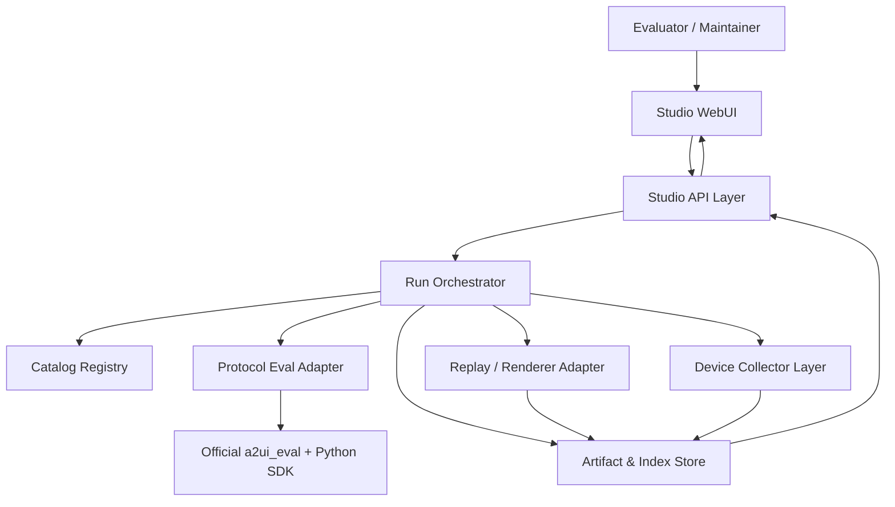
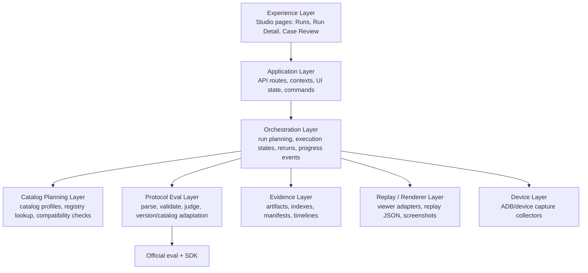
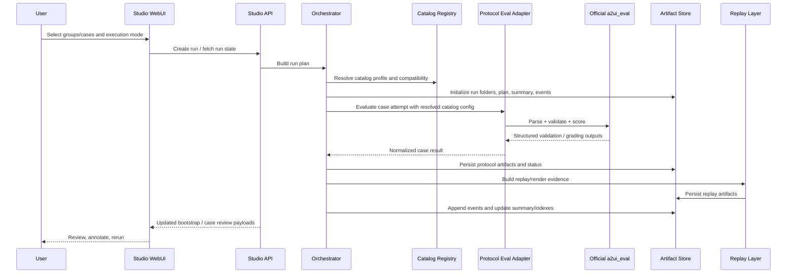
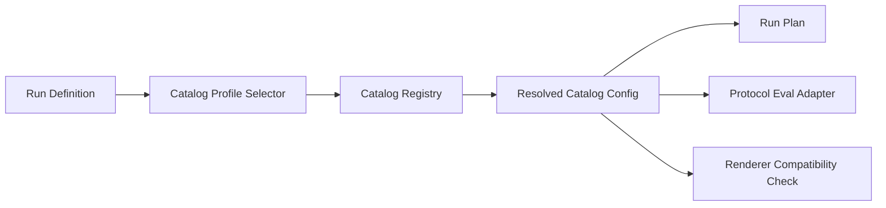
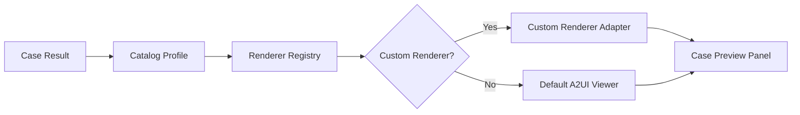
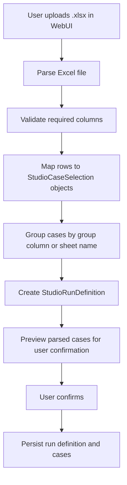
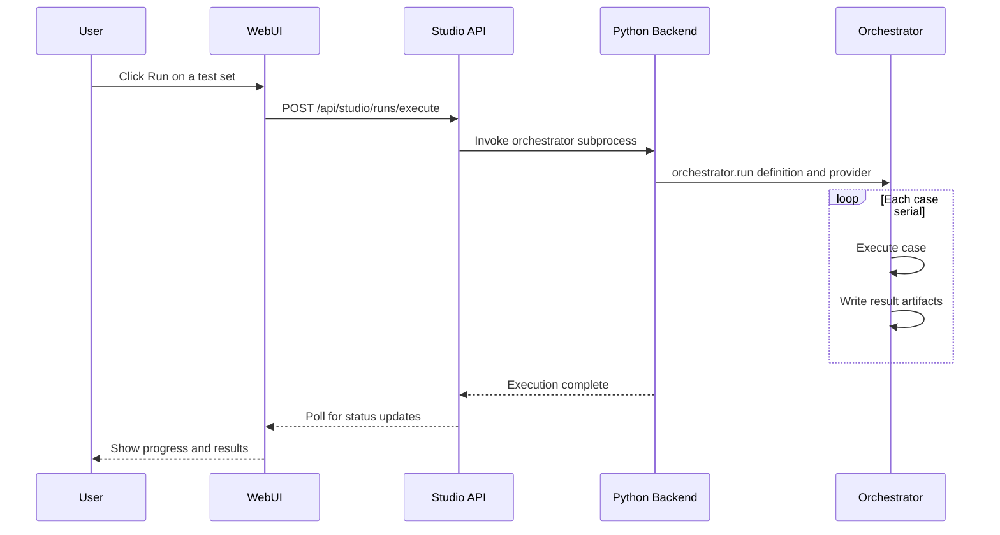
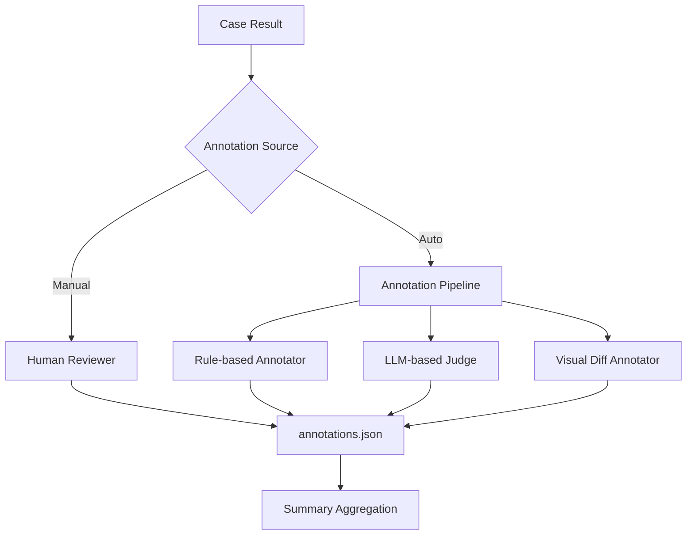
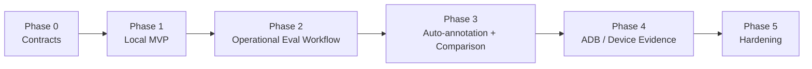
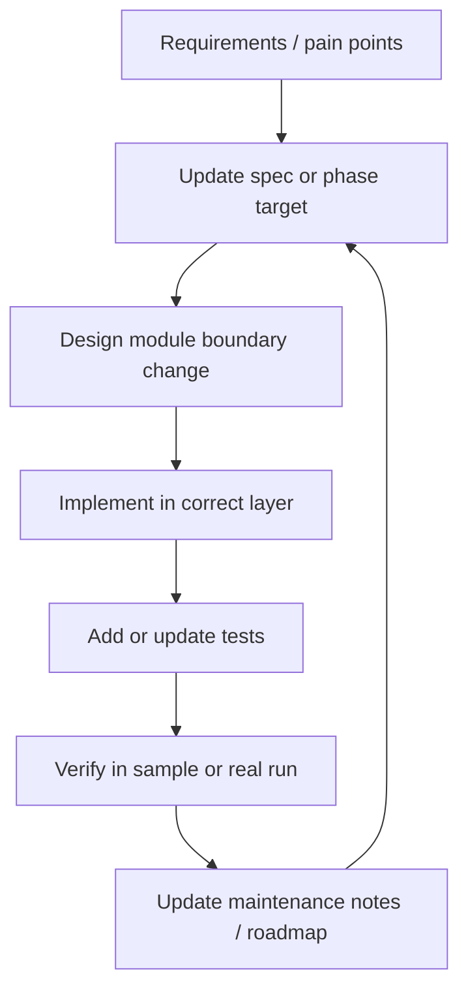

# Eval Studio Specification <span class="version-badge draft">v0.1 — Draft</span>

> This document defines the product expectations, architecture, phased delivery plan, and maintenance model for **A2UI Eval Studio**.
>
> It is intended to be the collaboration anchor for maintainers and contributors working across the official eval framework, the Studio UI, renderer integrations, and future device evidence collectors.

## Document Status

| Field | Value |
| --- | --- |
| **Status** | Draft |
| **Audience** | Maintainers, contributors, eval authors, renderer integrators |
| **Primary Scope** | Local-first production-grade Eval Studio for A2UI |
| **Related systems** | `eval/`, `tools/composer`, `specification/v0_9/eval/`, A2UI Python SDK |
| **Current implementation baseline** | MVP skeleton exists in `eval/a2ui_eval/studio_*` and `tools/composer/src/app/studio/*` |

## Overview

A2UI already provides the protocol, renderers, and an official eval foundation, but it does not yet provide a **production-grade evaluation workspace** for rapid testing, evidence review, human annotation, and iterative optimization.

Eval Studio fills that gap.

It is **not** a replacement for the official `a2ui_eval` package. Instead, it is a **control plane and review workspace** built on top of the official eval foundation. It adds:

- test-set grouping
- batch execution
- catalog-aware evaluation planning
- local artifact persistence
- replay and rendering review
- manual annotation workflows
- later, device evidence capture via ADB

The core design principle is:

> **Reuse the official eval stack for protocol correctness; add a Studio layer for orchestration, evidence, and iteration.**

## Goals

### Product goals

Eval Studio should enable a contributor or evaluator to:

1. define or select **groups** of test cases
2. run one or many groups/cases in **serial** or **parallel** mode
3. inspect results through a **WebUI**
4. review artifacts including:
   - raw protocol output
   - parsed and normalized messages
   - validation and scoring outcomes
   - replay/render evidence
   - later: device screenshots and logs
5. annotate failures and rerun selected subsets quickly
6. iteratively improve prompts, models, renderers, validators, and device integrations

### Engineering goals

Eval Studio should:

- stay aligned with official `a2ui_eval`
- preserve raw and derived artifacts for traceability
- keep protocol/version/catalog concerns isolated behind adapters
- use local filesystem storage rather than a database
- support staged evolution from MVP to production-grade tooling
- remain easy for maintainers to extend without cross-layer leakage
- support application-specific custom catalogs as a first-class eval input, not a one-off hack
- support pluggable custom renderers (e.g., `@yodaos-pkg/ink`) for application-specific catalog preview
- support Excel-based batch test set creation for evaluator convenience
- provide a WebUI-driven run execution flow with real-time progress feedback
- include a manual annotation framework that is architecturally ready for future automated annotation

## Non-goals

The first complete Eval Studio specification does **not** assume:

- a database-backed multi-user SaaS platform
- cloud-native orchestration as a hard requirement
- a rewrite of the official eval engine
- immediate support for all renderers equally
- immediate support for all device evidence collectors
- perfect parity across v0.8/v0.9/v0.10 from day one

## Current State vs Target State

### Current state

Today the repository has three relevant foundations:

1. **Official eval framework** under `eval/`
   - Python + Inspect AI orchestration
   - SDK-driven prompt/schema injection
   - protocol parsing and validation
   - judge-based semantic scoring

2. **Older richer prototype** under `specification/v0_9/eval/`
   - batch pipeline ideas
   - artifact persistence patterns
   - viewer/replay logic
   - richer validation diagnostics
   - group-oriented result artifacts

3. **First Eval Studio MVP skeleton**
   - backend skeleton in:
     - `eval/a2ui_eval/studio_types.py`
     - `eval/a2ui_eval/studio_storage.py`
     - `eval/a2ui_eval/studio_adapter.py`
     - `eval/a2ui_eval/studio_orchestrator.py`
     - `eval/bin/create_studio_run.py`
   - frontend skeleton in:
     - `tools/composer/src/app/studio/*`
     - `tools/composer/src/app/api/studio/*`
     - `tools/composer/src/contexts/studio-context.tsx`
     - `tools/composer/src/types/studio.ts`

### Target state

Eval Studio should evolve into a coherent local-first system that provides:

- structured run planning
- artifact lifecycle management
- renderer replay and screenshot workflows
- annotation-driven regression review
- run comparison and rerun subsets
- later, device evidence collection and infra hardening

### Current gaps

| Area | Current state | Target state |
| --- | --- | --- |
| Run creation | Script-based sample bootstrap | UI-driven run definition and batch selection |
| Catalog support | Adapter is effectively pinned to one basic catalog file | Registry-based catalog selection and per-case/per-run custom catalog evaluation |
| Scheduling | Simple synchronous orchestration skeleton | Real group/case execution planning with serial/parallel controls |
| Validation explainability | Basic adapter + official validator output | Structured targeted diagnostics and richer failure breakdown |
| Replay evidence | Replay JSON persisted; UI renders normalized messages | Replay timeline, screenshots, diffable visual evidence |
| Annotation | Not yet implemented | First-class annotation and review workflow |
| Device evidence | Not implemented | ADB screenshot/logcat/grep collector pipeline |
| Comparison workflow | Not implemented | Compare runs, rerun failed/labeled subsets |
| Hardening | Basic local files and indexes | resumability, retention policy, crash recovery, performance tuning |

## Core Domain Concepts

| Term | Meaning |
| --- | --- |
| **Run** | A single evaluation execution session initiated by the user |
| **Group** | A first-class test-set grouping used for selection, batching, filtering, and comparison |
| **Case** | A single test sample within a group |
| **Attempt** | One execution instance of a case under a chosen model / renderer / repeat count |
| **Artifact** | Any persisted output or evidence generated during evaluation |
| **Replay** | A reconstruction of the A2UI message stream for review or rendering |
| **Annotation** | Human feedback attached to a case result |
| **Collector** | A pluggable producer of additional evidence, such as screenshots or device logs |
| **Catalog Profile** | A reusable Studio-side definition describing which catalog, schema set, renderer support, and validation policy an eval run should use |
| **Catalog Registry** | The local registry that resolves a `catalogId` or profile name into concrete schema files and runtime capabilities |
| **Custom Renderer** | A pluggable renderer package that provides rendering support for application-specific catalog components beyond the basic catalog |
| **Renderer Registry** | The registry that maps `catalogId` patterns to renderer adapters for case preview in the Studio WebUI |
| **Test Set Template** | An Excel file (.xlsx) containing groups of prompts that can be imported to create structured test sets |
| **Label** | A structured annotation value attached to a case result, such as `correct`, `incorrect`, or `hallucination` |
| **Annotation Pipeline** | An extensible framework that supports both manual and future automated annotation of case results |

## Architecture Overview

Eval Studio is organized as a layered local-first architecture.



### Layer model



## Module Responsibilities

| Module | Owns | Depends on | Inputs | Outputs |
| --- | --- | --- | --- | --- |
| **Studio WebUI** | run browsing, review UX, annotation UX, filters, rerun affordances | Studio API, Composer viewer utilities | indexes, case payloads, user actions | UI state, review actions |
| **Studio API Layer** | browser-facing JSON APIs, data shaping, future action endpoints | Artifact store, orchestrator, filesystem | HTTP requests | bootstrap payloads, case review payloads |
| **Catalog Registry** | resolve `catalogId` / profile to schema files, renderer compatibility, validation policy, provenance | repo configs, spec files, future user-defined catalog manifests | catalog profile name, `catalogId`, spec version, renderer | resolved catalog config used by planner and adapter |
| **Run Orchestrator** | run planning, state transitions, event emission, execution coordination | Protocol adapter, artifact store, collectors | run definition, groups/cases | case results, events, summary updates |
| **Protocol Eval Adapter** | parsing, protocol validation, semantic scoring bridge | official `a2ui_eval`, Python SDK, Catalog Registry | raw completion, case config, resolved catalog config | normalized case result envelope |
| **Artifact & Index Store** | local filesystem persistence, manifests, summaries, indexes | run metadata, case results | structured run/case data | run folders, events.jsonl, indexes, manifests |
| **Replay / Renderer Layer** | reconstructing renderable state, screenshots, visual evidence | Composer viewer adapter, renderer runtime | normalized messages, render config | replay.json, screenshots, render evidence |
| **Device Collector Layer** | device-side evidence capture | future ADB/device adapters | case/run context | screenshot, logcat, grep outputs |
| **Custom Renderer Layer** | renderer adapter registration, dynamic renderer loading, catalog-to-renderer mapping | Catalog Registry, Renderer Registry | `catalogId`, renderer package reference | rendered preview, renderer compatibility result |
| **Annotation Layer** | annotation persistence, label taxonomy, annotation aggregation | Artifact Store, case results | reviewer actions, future auto-annotator output | `annotations.json`, annotation summaries |
| **Test Set Import Layer** | Excel parsing, case selection generation, run definition creation | Artifact Store, Catalog Registry | uploaded Excel file, run-level configuration | `StudioRunDefinition` with cases, persisted source artifact |
| **Governance / Spec Layer** | architecture rules, extension boundaries, phased plan | maintainers, docs site | design decisions, roadmap updates | spec, maintenance guidance |

## Runtime Relationships

### High-level execution flow



## Data and Storage Model

Eval Studio uses the local filesystem as the single source of persisted truth.

### Storage root

```text
.a2ui-eval-studio/
  config/
    catalogs/
      registry.json
      profiles/
        <profile-id>.json
  runs/
    run-<timestamp-or-id>/
      run.json
      plan.json
      events.jsonl
      summary.json
      groups/
        <group-id>/
          group.json
          summary.json
          cases/
            <case-id>/
              case.json
              status.json
              annotations.json
              catalog.json
              protocol/
              render/
              device/
              artifacts/
                manifest.json
                timeline.json
  indexes/
    runs.json
    groups.json
    cases.json
```

### Storage rules

1. `events.jsonl` is the append-only execution history for a run.
2. `summary.json` and `indexes/*.json` are materialized views for fast loading.
3. `manifest.json` is the semantic lookup layer for artifacts.
4. raw protocol outputs and normalized protocol outputs must both be persisted where available.
5. device evidence is optional in MVP but its directory and contract are reserved now.
6. every run and case must persist the resolved catalog identity and schema provenance used during evaluation.

## Catalog Extension Architecture

Custom catalog support is a core requirement for A2UI eval work because production applications rarely evaluate against the basic catalog alone.

Eval Studio therefore should treat catalog selection as a first-class planning concern, not as an implementation detail hidden inside the validator.

### Design principles

1. catalog choice must be explicit at run time and persisted with artifacts
2. custom catalogs must reuse the same official parser/validator path as built-in catalogs
3. catalog resolution must be separated from orchestration so new catalogs do not require changing run logic
4. a single run may contain multiple groups or cases that target different catalogs, as long as compatibility is declared up front
5. renderer support and validator support must both be checked before execution starts

### Catalog profile contract

A Studio catalog profile should be the unit of extension exposed to run creation.

Each profile resolves to:

- `profileId`: stable Studio identifier, for example `a2ui-basic-v0_9` or `crm-design-system-v1`
- `catalogId`: canonical A2UI catalog identifier announced to the model/runtime
- `specVersion`: protocol version such as `0.9`
- `catalogSchema`: path or inlined schema object
- `serverToClientSchema`: path or inlined schema object when version-specific override is required
- `commonTypesSchema`: optional path or object for schema families that split common types
- `rendererSupport`: supported renderer IDs and optional feature flags
- `validationPolicy`: optional toggles for strictness, repair, semantic judge settings, or allowlisted fixes
- `provenance`: source metadata such as repo path, package version, git ref, or generated timestamp

This shape intentionally mirrors the existing conformance direction where schema inputs can be provided as either paths or inlined objects.

### Resolution model



Resolution should support three input modes:

1. **Named profile**: preferred for normal Studio usage. Example: select `crm-design-system-v1`.
2. **Direct `catalogId` lookup**: resolve against the local registry when the case already declares a canonical A2UI catalog ID.
3. **Inline or ad hoc catalog**: useful for experimental eval authoring, but should still be normalized into a resolved profile snapshot before execution.

### Planned backend seam

The current MVP adapter is initialized with one concrete `catalog_path`, which is too narrow for Eval Studio.

The target seam should look conceptually like this:

- `CatalogRegistry`
  - loads known profiles from `config/catalogs/registry.json` and profile files
  - resolves run-level default catalog plus case-level overrides
  - verifies `specVersion` and renderer compatibility before a run starts
- `ResolvedCatalogConfig`
  - immutable object passed into the planner, adapter, storage, and replay layers
  - contains concrete schema paths/objects plus provenance metadata
- `ProtocolEvalAdapterFactory`
  - builds a validator-backed adapter per resolved catalog instead of pinning the process to one global basic catalog

This keeps the official SDK integration path intact while making custom catalog evaluation composable.

### Run planning rules for custom catalogs

1. a run may define a default catalog profile in `run.json`
2. a group may inherit the run default or declare its own override
3. a case may inherit the group default or declare its own override
4. the final effective catalog must be resolved before the case enters execution
5. unresolved or incompatible catalog profiles should fail in planning with `error_infrastructure`, not appear as protocol failures

### Storage and traceability rules

For each run and case, Studio should persist:

- requested profile reference
- resolved `catalogId`
- resolved schema paths or inlined schema hash
- renderer compatibility result
- validation policy snapshot
- provenance metadata

This is necessary because the same prompt may behave differently across custom catalogs even when the model and protocol version are unchanged.

### What “support custom catalog eval” means in practice

Supporting custom catalogs is broader than passing a different JSON schema file into the validator.

It means Eval Studio can:

- author or import cases that target app-specific components
- run those cases against the correct catalog without code edits in the orchestrator
- render or replay results only on renderers that actually implement that catalog
- compare outcomes across catalog versions, for example `crm-v1` vs `crm-v2`
- preserve enough provenance to reproduce the exact eval later

### Compatibility checks before execution

Before a run starts, Studio should validate:

1. the catalog profile resolves successfully
2. the declared `catalogId` matches the resolved schema metadata
3. the selected renderer can load or replay that catalog
4. the requested spec version is supported by both the SDK and the renderer path
5. optional semantic scorers or repair steps are allowed for that profile

These checks belong in run planning, not in late case failure handling.

## Custom Renderer Integration

### Background

Production A2UI applications often use custom catalogs that require application-specific renderers. Eval Studio must support pluggable renderer packages so that case results targeting custom catalogs can be previewed correctly in the Studio WebUI.

### Target Integration: `@yodaos-pkg/ink`

The first custom renderer integration targets the Ink renderer package (`@yodaos-pkg/ink`), which provides rendering support for the custom catalog at:

```
https://jsar-project.github.io/ink/a2ui/catalog.json
```

This catalog defines application-specific components beyond the A2UI basic catalog and is tested against the v0.9 protocol version.

### Renderer adapter contract

A custom renderer adapter must:

1. declare which `catalogId` patterns it supports
2. accept the same normalized message stream as the built-in viewer
3. produce a renderable surface compatible with the Studio case review panel
4. fall back gracefully when a component type is unsupported
5. register in a renderer registry analogous to the catalog registry

### Resolution model



### Frontend integration pattern

The `A2UIViewer` component should be extended to support renderer selection:

1. when a case specifies a `catalogId` that maps to a custom renderer, the viewer delegates to the appropriate renderer adapter
2. the custom renderer is loaded dynamically to avoid bundling unused renderers
3. the renderer adapter wraps the custom package and exposes a standard `<CustomRendererViewer>` component interface
4. a fallback message is shown if the renderer package is not installed

## Excel-Based Test Set Creation

### Motivation

Evaluators often maintain test cases in spreadsheet form. Eval Studio should support importing Excel files (.xlsx) containing groups of prompts to automatically create structured test sets, eliminating manual case-by-case entry.

### Excel format contract

The expected Excel format:

| Column | Required | Description |
| --- | --- | --- |
| `group` | Optional | Group ID or label; rows without a group inherit a default |
| `prompt` | Required | The prompt text to send to the model |
| `description` | Optional | Human-readable case description |
| `target` | Optional | Expected output or target criteria |
| `context` | Optional | Additional context for the prompt |
| `spec_version` | Optional | Protocol version override (default: run-level setting) |
| `renderer` | Optional | Renderer override (default: run-level setting) |
| `catalog_id` | Optional | Catalog override (default: run-level setting) |

Multiple sheets in a single Excel file may map to multiple groups.

### Import workflow



### Backend support

- new API route: `POST /api/studio/runs/create` — accepts a multipart form with an Excel file plus run-level configuration (model, catalog profile, execution mode)
- parser utility: converts Excel rows into `StudioCaseSelection` objects, supporting both Python-side and Node.js-side parsing
- validation: reject files with missing required columns, duplicate case IDs, or unresolvable catalog profiles
- uploaded Excel files are persisted as source artifacts under `runs/<run-id>/source/` for traceability

## Run Execution from WebUI

### Motivation

Currently runs can only be created and executed via CLI scripts. Eval Studio should support triggering run execution directly from the WebUI, starting with serial execution of individual cases.

### Execution model

Phase 2 supports **serial execution only**: cases are run one at a time in group order.



### API design

| Route | Method | Purpose |
| --- | --- | --- |
| `/api/studio/runs/create` | POST | Create run definition from Excel or manual input |
| `/api/studio/runs/execute` | POST | Trigger execution of a created run |
| `/api/studio/runs/[runId]/status` | GET | Poll run execution progress |
| `/api/studio/runs/[runId]/events` | GET | Stream execution events (future SSE) |

### Completion provider

For v0.1, the `CompletionProvider` can be:

1. **Mock provider**: returns hardcoded or template-based completions for testing the pipeline
2. **LLM provider**: calls a configured model API (OpenAI, Gemini, etc.) with the prompt
3. **Static provider**: reads pre-recorded completions from the Excel file (for replay/review scenarios)

The provider type is selected at run creation time.

### Progress tracking

- the orchestrator emits `StudioEvent` entries to `events.jsonl` during execution
- the API exposes a polling endpoint that reads the latest summary and events
- the WebUI shows a progress bar with case-level status updates
- future: SSE for real-time streaming updates without polling

## Annotation Framework

### Motivation

After running evaluations, reviewers need to inspect results, label issues, and track quality trends. Eval Studio should provide a structured annotation workflow that enables manual labeling in v0.1 and is architecturally ready for automated annotation in future phases.

### Annotation data model

Each case persists an `annotations.json` file with the following structure:

```json
{
  "annotations": [
    {
      "annotation_id": "ann-001",
      "created_at": "2025-01-01T00:00:00Z",
      "author": "human",
      "type": "label",
      "value": "correct",
      "confidence": null,
      "source": "manual",
      "metadata": {}
    }
  ]
}
```

| Field | Description |
| --- | --- |
| `annotation_id` | Unique identifier |
| `created_at` | Timestamp |
| `author` | `"human"` or future `"auto:<model-name>"` |
| `type` | Annotation type: `label`, `note`, `disposition`, `score` |
| `value` | The annotation value (e.g., `"correct"`, `"incorrect"`, free text for notes) |
| `confidence` | Optional confidence score for automated annotations |
| `source` | `"manual"` or `"auto"` |
| `metadata` | Extensible metadata dict |

### Label taxonomy

Standard labels for v0.1:

| Label | Meaning |
| --- | --- |
| `correct` | Output matches expected behavior |
| `incorrect` | Output does not match expectations |
| `partial` | Partially correct output |
| `hallucination` | Model hallucinated components or properties |
| `rendering_issue` | Protocol correct but rendering broken |
| `prompt_issue` | Failure likely due to prompt quality |
| `needs_review` | Requires further expert review |

### Manual annotation workflow (v0.1)

1. reviewer opens a case result in the Case Review page
2. left panel shows validation summary and current annotations
3. reviewer selects a label from a dropdown and optionally adds a note
4. annotation is persisted to `annotations.json` in the case directory via `POST /api/studio/annotations`
5. group and run summaries update annotation counts for dashboard views

### Architecture for auto-annotation (future)

The annotation framework is designed to support automated annotation without changing the storage or UI contracts:



Auto-annotation is **not implemented in v0.1** but the data model and storage contracts support it:

- `source` field distinguishes manual from automated annotations
- `author` field identifies the specific annotator or model
- `confidence` field enables filtering by annotation quality
- multiple annotations per case are supported for comparison between annotators

## Artifact Model

### Protocol artifacts

- `prompt.txt`
- `context.txt`
- `raw_completion.md`
- `parsed_messages.json`
- `normalized_messages.json`
- `validation.json`
- `semantic_eval.json`

### Render artifacts

- `replay.json`
- `screenshot.png`
- optional `dom.html`
- optional `render.log`
- future `diff.png` / frame snapshots

### Device artifacts

- `adb-screenshot.png`
- `logcat.txt`
- `grep.txt`
- `capture.json`

## WebUI Information Architecture

### Core pages

| Page | Purpose | Status |
| --- | --- | --- |
| **Runs** | Show recent runs, load indexes, entry point to review | Phase 1 — implemented |
| **Run Detail** | Show run-level summary and group navigation | Phase 1 — implemented |
| **Case Review** | Show case metadata, render preview, evidence panels, annotations | Phase 1 skeleton — Phase 2 enhancement |
| **Run Creation** | Excel import, run configuration, case preview, execution trigger | Phase 2 — planned |
| **Group Detail** | Group filters, case list, rerun failed, annotation summaries | Phase 2 — planned |
| **Annotation Panel** | Label selector, note editor, annotation history (within Case Review) | Phase 2 — planned |
| **Run Progress** | Real-time execution progress, case status updates | Phase 2 — planned |
| **Settings** | Renderer config, model API keys, collector configs, catalog profiles | Phase 3 — planned |

### UX principles

1. failed and unreviewed items should be easy to find first
2. the source of each artifact must be explicit
3. raw vs normalized vs repaired views must never be conflated
4. heavy evidence should be lazy-loaded
5. the UI should remain useful even when device evidence is absent

## Phased Delivery Plan

### Delivery roadmap

| Phase | Goal | Deliverables | Exit criteria |
| --- | --- | --- | --- |
| **Phase 0** | Define contracts and module seams | run/case/event/artifact schemas, catalog profile + registry contract, protocol adapter boundary, renderer/device interfaces | storage model and interfaces are stable enough to implement MVP without churn |
| **Phase 1** | Deliver local MVP control plane | orchestrator skeleton, file-backed artifact store, composer-hosted UI, sample run bootstrap, basic replay view, catalog-aware run planning | user can create or load a local run, browse runs, open case review, inspect normalized protocol evidence, and see which catalog profile was used |
| **Phase 2** | Operational eval workflow | custom catalog + Ink renderer integration, Excel-based test set creation, UI-driven run creation and serial execution, result review UX improvements, manual annotation framework, validation diagnostics, replay timeline, auto-annotation architecture (design only) | user can import test sets from Excel, run evaluations from WebUI, review results with custom renderers, and annotate case outcomes |
| **Phase 3** | Auto-annotation and comparison | automated annotation pipeline implementation, run comparison workflow, rerun failed/labeled subsets, cross-catalog regression review, annotation export/import | annotation-driven iteration is automated and supports team collaboration |
| **Phase 4** | Add device evidence capture | ADB adapter, screenshot/logcat/grep collectors, device preflight and serialization | Studio can persist device evidence as part of selected run types |
| **Phase 5** | Harden for sustained use | resumability, retention policy, crash recovery, performance tuning, larger-run support | tool remains stable and maintainable for daily team use |

### Phase relationship diagram



### Phase 2 sub-deliverables

Phase 2 is the largest delivery phase. The following sub-deliverables define its internal execution order:

| Sub-phase | Deliverable | Dependencies |
| --- | --- | --- |
| **2a** | Custom catalog profile for Ink (`@yodaos-pkg/ink`) + renderer registry | Phase 1 catalog registry |
| **2b** | Excel import parser and `POST /api/studio/runs/create` API | Phase 1 storage model |
| **2c** | Run execution from WebUI (`POST /api/studio/runs/execute`, serial mode) | 2b run creation |
| **2d** | Result review UX: tabbed evidence panels, validation diagnostics, replay timeline | Phase 1 case review page |
| **2e** | Manual annotation framework: label UI, persistence, summary aggregation | 2d result review |
| **2f** | Auto-annotation architecture: data model and pipeline interfaces (no implementation) | 2e annotation storage |

## Current Implementation Map

### Backend skeleton

| File | Current role |
| --- | --- |
| `eval/a2ui_eval/studio_types.py` | shared data structures for runs, cases, events, summaries |
| `eval/a2ui_eval/studio_storage.py` | filesystem layout, write/read helpers, index rebuild |
| `eval/a2ui_eval/studio_adapter.py` | parse + validate wrapper over official SDK-backed flow; currently pinned to one catalog input |
| `eval/a2ui_eval/studio_orchestrator.py` | MVP run planning and synchronous execution skeleton; future home of catalog-profile-aware planning |
| `eval/bin/create_studio_run.py` | sample run bootstrap script for local UI development |

### Frontend skeleton

| File | Current role |
| --- | --- |
| `tools/composer/src/app/studio/page.tsx` | runs overview page |
| `tools/composer/src/app/studio/run/[runId]/page.tsx` | run detail page |
| `tools/composer/src/app/studio/run/[runId]/group/[groupId]/case/[caseId]/page.tsx` | case review page |
| `tools/composer/src/app/api/studio/bootstrap/route.ts` | bootstrap indexes API |
| `tools/composer/src/app/api/studio/case/route.ts` | case review payload API |
| `tools/composer/src/contexts/studio-context.tsx` | UI bootstrap/loading context |
| `tools/composer/src/types/studio.ts` | browser-side Studio types |
| `tools/composer/src/lib/studio-storage.ts` | local UI-side bootstrap cache |

### Reused viewer/runtime foundations

| Existing module | Reused role |
| --- | --- |
| `eval/tasks.py` | official task wiring reference |
| `eval/a2ui_eval/solvers.py` | SDK prompt/context generation reference |
| `eval/a2ui_eval/scorers.py` | parser/validator/judge bridge reference |
| `agent_sdks/conformance/conformance_schema.json` | reference contract for path-or-inline catalog/schema resolution |
| `tools/composer/src/lib/a2ui.tsx` | spec-version-aware viewer adapter |
| `tools/composer/src/components/theater/useA2UISurface.ts` | normalized messages → renderable surface state |
| `renderers/react/visual-parity/tests/visual-parity.spec.ts` | future screenshot collection strategy reference |
| `specification/v0_9/eval/src/validator.ts` | future targeted validation diagnostic source |

## Extension Points

### Add a catalog profile

A new custom catalog integration should:

- register through the Catalog Registry rather than hardcoding paths in the orchestrator
- declare spec version, schema provenance, and renderer compatibility
- support path-based or inlined schema resolution
- produce a stable `profileId` so runs remain reproducible
- be testable without requiring changes to unrelated built-in catalogs

### Add a renderer adapter

A new renderer integration should:

- live in the replay/renderer layer
- avoid leaking renderer-specific structures into the orchestrator
- preserve the canonical case result envelope
- continue to store raw protocol artifacts unchanged
- declare which catalog profiles or `catalogId` patterns it supports

### Add a collector

A new collector should:

- accept case/run context as input
- persist into the `device/` or collector-specific artifact space
- register stable artifact IDs in `manifest.json`
- never mutate protocol validation results

### Add a validator augmentation

A validator enhancement should:

- build on top of the Protocol Eval Adapter boundary
- produce structured errors
- preserve raw validator outputs where possible
- avoid coupling UI directly to provider/SDK-specific exception shapes

### Add a Studio page

A new Studio page should:

- consume typed API outputs rather than direct filesystem assumptions
- treat bootstrap indexes as summaries, not source of truth
- lazy-load heavier artifacts when possible

## Collaboration and Maintenance Rules

### Ownership rules

| Concern | Primary home |
| --- | --- |
| Protocol correctness | official `eval/a2ui_eval` + SDK integration |
| Catalog profile resolution | future registry module on eval-side Studio backend |
| Local run storage | `eval/a2ui_eval/studio_storage.py` and related backend modules |
| Studio orchestration | `eval/a2ui_eval/studio_orchestrator.py` |
| Browser UI and navigation | `tools/composer/src/app/studio/*` |
| Renderer preview integration | Composer viewer adapters and replay layer |
| Device evidence collection | future collector modules beneath eval-side Studio backend |
| Architecture/maintenance policy | this specification |

### Boundaries that must be preserved

1. **UI must not own protocol validation logic.**
2. **Protocol adapter must not assume browser concerns.**
3. **Catalog resolution must happen before protocol execution, not be inferred from validator exceptions.**
4. **Storage format changes must be reflected in this spec and migration notes.**
5. **Custom catalog support must be implemented through registry/profile extension points, not per-app branches in orchestration code.**
6. **Collectors must be additive; they must not rewrite canonical protocol artifacts.**
7. **Renderer-specific assumptions must stay out of run planning and case identity.**

### Required updates when extending the system

When adding a major capability, contributors should update:

- this specification
- any affected API payload shape documentation
- tests for the changed module seam
- the phase table if the capability changes roadmap assumptions

## Recommended Maintenance Workflow



## Testing and Verification Strategy

### Backend

- contract tests for protocol adapter behavior
- catalog registry resolution tests
- run planning tests with run/group/case-level catalog overrides
- artifact persistence tests
- index rebuild tests
- orchestrator execution tests

### Frontend

- bootstrap data loading tests
- run navigation and case review rendering tests
- lazy evidence loading tests
- viewer/replay integration tests

### End-to-end

- create or bootstrap a run
- inspect runs in UI
- open run detail
- open case review
- verify stored evidence paths and rendering
- later: verify annotation and rerun flows

## Open Questions

1. Should Studio treat inline/ad hoc custom catalogs as temporary experiments only, or persist them as first-class reusable profiles after the first run?
2. When screenshot collection is introduced, should it live in the Python backend, the Composer runtime, or a hybrid path?
3. What is the minimum supported protocol version set for production use: v0.9 only, or v0.8 compatibility as well?
4. Should annotations remain local-only, or eventually support export/import workflows for team sharing?
5. How should device collectors report infra failures vs product failures in UX and summary metrics?
6. Do we need cross-run comparison UX specifically for catalog migrations, such as `catalog-v1` to `catalog-v2` regression review?
7. Is `@yodaos-pkg/ink` published as a public npm package, or does it require a private registry or local linking for installation?
8. For Excel import, should the parser live in the Python backend (using `openpyxl`) or the Node.js frontend (using `xlsx` / `exceljs`)?
9. What LLM model APIs should the first `CompletionProvider` support (OpenAI, Gemini, local models)?
10. Should auto-annotation confidence thresholds be configurable per catalog profile or globally?
11. For run execution, should the Python orchestrator be invoked as a subprocess from the Next.js API, or should a separate Python API server be introduced?

## Immediate Next Steps

1. ~~Introduce a `Catalog Registry` contract and persist profile snapshots under `.a2ui-eval-studio/config/catalogs/`.~~ ✅ Phase 1 complete.
2. ~~Refactor the Protocol Eval Adapter so it is created from resolved catalog config rather than one global basic catalog path.~~ ✅ Phase 1 complete.
3. Register the Ink custom catalog profile (`@yodaos-pkg/ink`) in the Catalog Registry and verify renderer loading.
4. Implement Excel-based test set import: parser utility, `POST /api/studio/runs/create` API route, and WebUI upload form.
5. Implement `POST /api/studio/runs/execute` for serial run execution from the WebUI with progress polling.
6. Enhance case review page with tabbed evidence panels, validation diagnostics, and replay timeline.
7. Implement manual annotation framework: label UI in case review, `POST /api/studio/annotations` API, `annotations.json` persistence.
8. Port richer validation diagnostics from the older prototype into the Protocol Eval Adapter boundary.
9. Design auto-annotation pipeline interfaces and document in this specification.
10. Add a documentation link in site navigation once this spec is accepted.

## End-state Expectation

Eval Studio is expected to become the **local-first operational workspace** for A2UI evaluation work:

- official eval remains the protocol and scoring core
- Studio owns orchestration, evidence, and review workflows
- contributors can iterate quickly through grouped runs and annotations
- maintainers can evolve the system by extending clean layer boundaries rather than rewriting the stack
